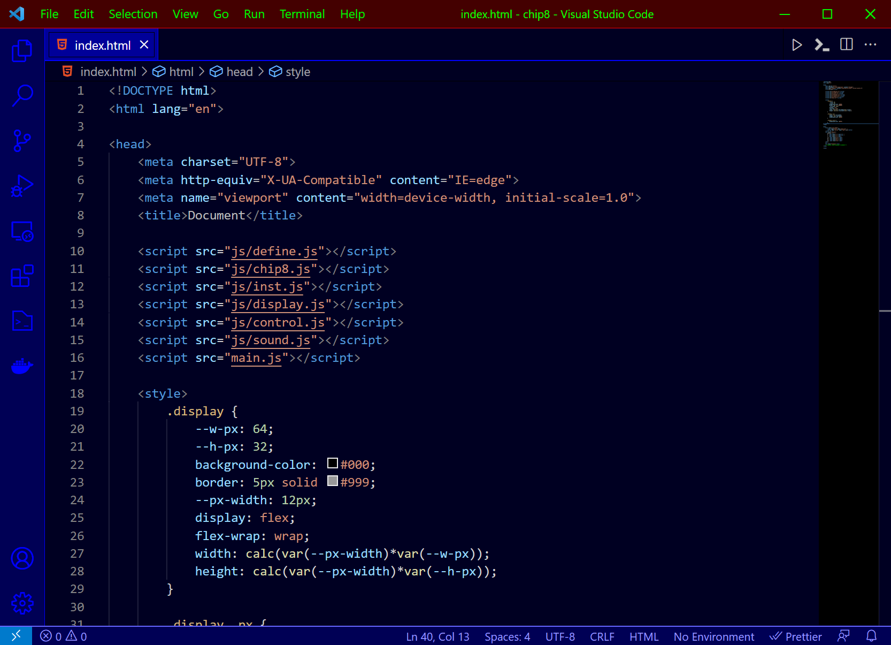
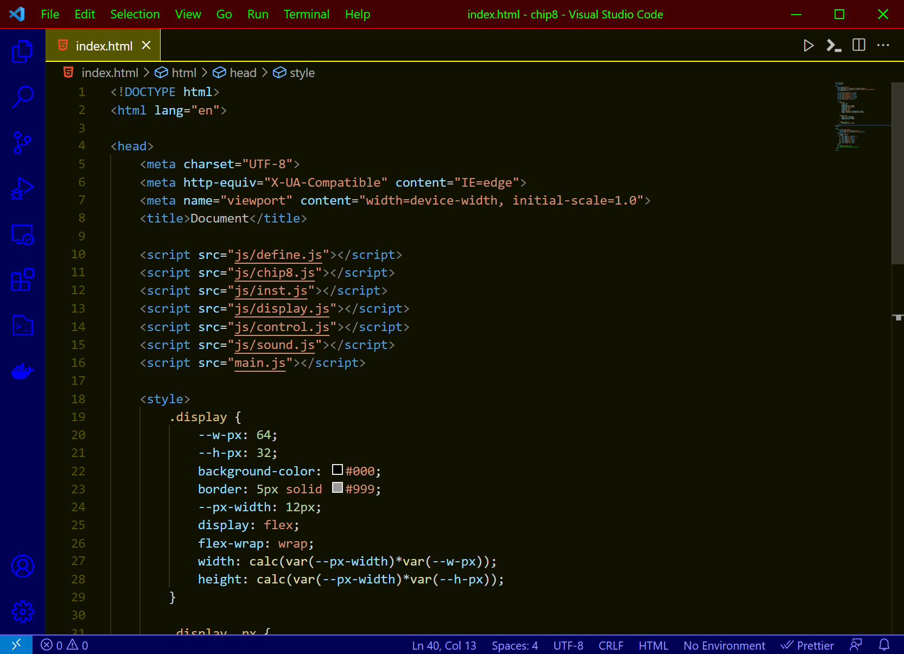
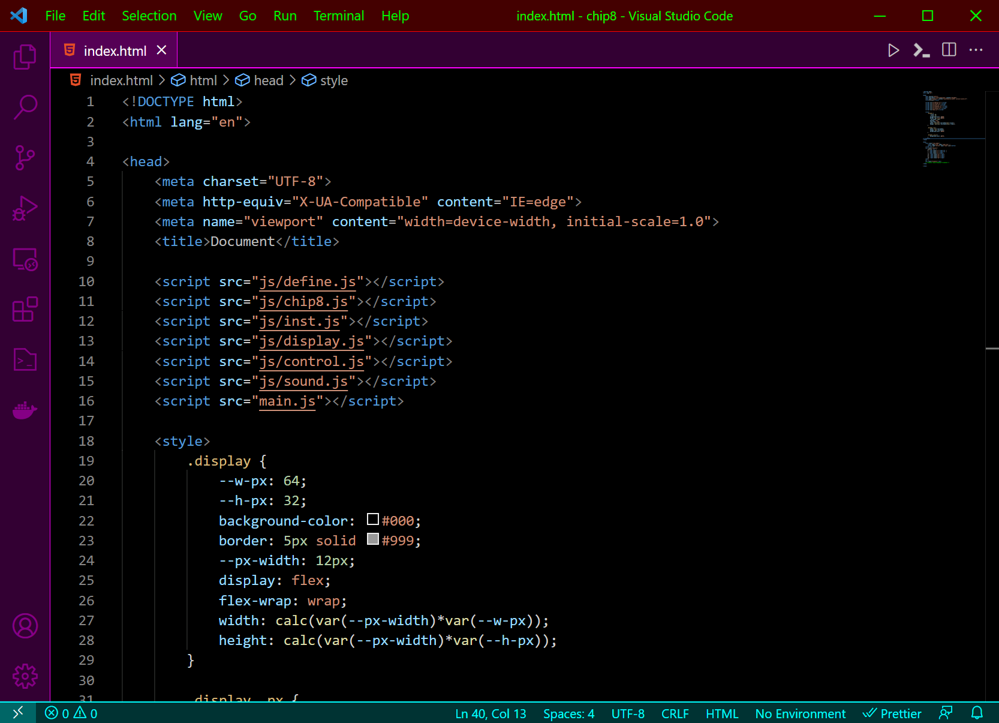
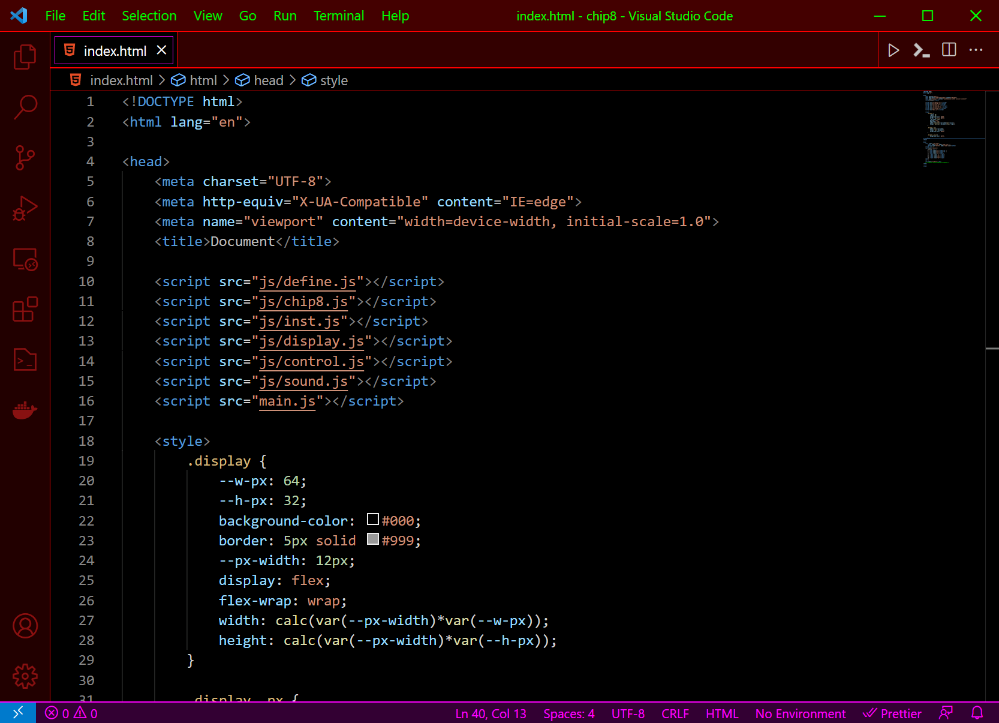

# TX-Neon Theme

This is a dark theme for Visual Studio Code.

See the [CHANGELOG](CHANGELOG.md) for the latest changes.

It's a theme that I always used in the workplace. 😎

I usually use a different theme to remind me in which stage of work.

Let me know if you like it. 👍

## Blue (Updated)

## Blue/Yellow (New)

## Purple (Updated)

## Red (Updated)

## Green

## Cyan

## Yellow

